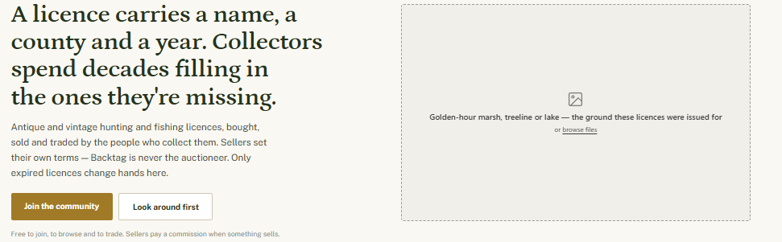

# Backtag — Implementation Plan

Scope: navigation rename, header cleanup, signed-out hero, greeting system, badge updates, collection-sharing mechanics, season-date features.

---

## 1. Main Navigation

New top-level nav, in order:

**The Market · Collections · Research · Dashboard**

| New label | Replaces | Notes |
|---|---|---|
| The Market | Hunt | Umbrella for all buying/selling/trading. Contains the existing sub-sections: The Auction House, The General Store, The Trading Block. |
| Collections | Collections | No change. |
| Research | The Almanac | Nav label only; opens a section landing with two areas (below). |
| Dashboard | My Bench | User workspace: bids, orders, offers, watch list, settings entry point. |

### Research contains two areas

**The Field Guide** — the reference wikis. One page per state, county, era, and special license type: history, identifying features, known variants, first-issue years. This is the existing Almanac wiki content under a new name.

**The Archives** — a searchable record of every public item on the site, past and present. Search returns a table of results (state, county, year, type, serial where public) with each row linking to the item page. Items remain in The Archives after they sell or trade — the purpose is a permanent census of what survives, not a browse of what's for sale. Public items only.
Just create shell in this pass.

---

## 2. Header (signed in)

Target: two bars (brand bar + nav bar). Currently three.

- **Remove the utility strip** (tagline / date / sign out). Tagline moves to the footer. Date is removed.
- **Sign out** moves to the bottom of the avatar dropdown. Dropdown order: Profile -> Settings → divider → Sign out.
- **Remove the logo sub-line** ("EST. 2026 · PENNSYLVANIA"). Logo stands alone.
- **Sticky condensed header on scroll:** logo, search, Mail/Alerts, LIST AN ITEM, and avatar remain; nav row and stat line collapse.
- **Search:** keep the current placeholder text. Add a `/` keyboard shortcut to focus the field (cmd/ctrl-K as well, for those feeling modern). Add typeahead with results grouped by type: Listings / Collectors / Counties. The Archives search will eventually run through this same box.
- **Notification badge color:** red only when user action is required (ship-by deadline, payment due). Neutral badge color for informational counts (unread mail, watched-item activity).
- **Dashboard action dot:** small indicator on the Dashboard nav item whenever something is waiting on the user (order to ship, offer expiring). Distinct from Alerts, which covers things that happened.
- Unchanged: single gold LIST AN ITEM CTA, stat line (items · counties · collectors), active-tab underline, Mail/Alerts labels.

---

## 3. Homepage Hero (signed out)

Three lines, in this order, styled as headline / supporting line / closer:

> **Nobody collects these to get rich.**
> Buy, sell, and trade with people who know what they're looking at, and keep building the collection only you're chasing.
> *History isn't going to save itself.*
> placeholder for hero image on right side.

layout (but use text above instead):

- **CTA button:** `Join the collection` or 'Look around first' subtitle "Free to join, to browse and to trade. Sellers pay a commission when something sells."

---

## 4. Greeting System

One greeting renders on the signed-in home page per visit. Phrases live in a library organized by bucket; each bucket has a display condition. Selection: gather all buckets whose condition is currently true, pick a random phrase from the combined eligible pool, avoiding a repeat of the user's last-shown phrase. Evergreen is always eligible and serves as the fallback.

### Activity-driven — condition: the referenced event is actually true for this user
- Something's waiting in the trade box. *(open incoming trade offer)*
- A trade offer's on the table. *(open incoming trade offer)*
- One bid came in overnight. *(new bid on user's listing since last visit)*
- Your wanted list got a hit. *(new listing matches a wanted-list entry)*
- New listing since you left. *(any new listing in user's followed counties/states since last visit)*
- Two came in while you were out. *(template: `{n} came in while you were out.` — new listings since last visit, n ≥ 2)*

### Stat-driven — condition: user has collection data; values are computed, not hardcoded
- Sixty-two of sixty-seven. *(template: `{count} of {total}.` — county completion in user's primary state, number words preferred)*
- Forty-one counties down. *(template: `{count} counties down.`)*
- One county left in Maryland. *(template: `One county left in {state}.` — fires only when exactly one county is missing in a state)*
- Still chasing '37, [name]? *(template: `Still chasing '{yy}, {name}?` — a year present on the user's wanted list)*

### Season-driven — condition: keyed to season dates for the user's state from Settings
- Small game in two weeks. *(template window: 10–18 days before opener)*
- Opening day's closer than you think. *(30–60 days before a major opener)*
- Opening day in nine weeks. *(template: `Opening day in {n} weeks.`)*
- Archery season's close. *(7–21 days before archery opener)*
- Deer camp weather. *(within 14 days of firearms deer opener)*
- Last light of the season. *(final 7 days of a major season)*

If the user has no state set, this bucket is ineligible.

### Time-gated — condition: user's local time
- Morning (05:00–11:00): First light already. / Cold morning for it. / Fair morning for county-chasing.
- Evening (17:00–21:00): Evening, snipe hunter.
- Night (21:00–04:00): Late one tonight, huh.

*(Evening and night need 2–3 more phrases each before launch; morning is at depth.)*

### Personalized — condition: display name available
- Welcome back, [name].
- Good to see you, [name].
- Back at the bench, [name].

### Evergreen — always eligible
- Good scouting weather out there.
- Back tag weather, if there's such a thing.
- Zeroed the rifle yet?
- Public land's calling your name.
- Quiet as a Sunday license office.
- Nothing wrong with another look.
- Still holds up, this weather.
- You know where the good ones hide.
- You're closer than you think.
- You've earned a look today.
- The counties don't fill themselves.
- Kept the bench warm for you.
- Not much moving. Worth a look anyway.
- Album's got room for one more.
- New listing since you left. *(move to Activity if wired to real data; otherwise cut)*
- Drawer's not as full as it looks.
- Wind's up. Good day to sit and look.
- Your collection always got room for one more.

---

## 5. Badges

Existing four-category structure and permanent-vs-rolling behavior are unchanged. Changes are renames and new badges only.

### Renames (criteria unchanged)

| Current | New | Reason |
|---|---|---|
| All Sixty-Seven | Whole State | Title must not hardcode a count — the criterion is state-agnostic (67 counties in PA, 64 parishes in LA). |
| Named a Type | Called It Right | |
| Ships Quick | Quick to Post | |
| Thirty Days | Unbroken | |
| Top of the Board | Held the Month | |

Unchanged: Run Complete, Before the War, Wrote the Entry, Set It Straight, Twenty-Five Clean, Traded True.

### New badges

| Badge | Category | Earned when | Type |
|---|---|---|---|
| Nothing Left Out | Dealt Straight | Ten consecutive listings with every recommended field completed (per `listing_completeness_score`), not just required fields. Streak resets on an incomplete listing. | Rolling — lapses if the streak breaks |
| All Three | Ground Covered | Collection contains at least one public item from each of PA, MD, and OH. | Permanent |
| Crossed State Lines | Dealt Straight | One completed trade (both sides confirmed receipt) where the two collectors have different home states. | Permanent |
| Floor Year | New fifth category | Collection contains a public item dated to a verified first-issue year in the reference data. Badge names the item: *floor year: PA Elk, 2001.* | Permanent |
| Early Season | New fifth category | Account is among the site's first 100 registered. | Permanent |
| Late Bench | New fifth category | Ten site visits with a session start between 00:00 and 04:00 user local time. | Permanent |

**Fifth category:** a lighter group for badges that recognize presence rather than achievement (Floor Year, Early Season, Late Bench). Category name TBD; renders after the existing four.

**Rule change:** all badge criteria count **public items only**, across every category. Private items never contribute to badge progress.

---

## 6. Collection Sharing Mechanics

Goal: make public collections the default path without forcing them.

- **Visibility ladder** on each collection, per item and per layer:
  1. County-completion map public, items private (profile shows *34 of 67*, no items).
  2. Featured items public (user picks up to 6), rest private.
  3. Full collection public.
- **Trade dependency:** only public items are eligible for trade offers and trade matching. Surface this in UI copy wherever an item is set private: private items can't receive offers or appear in matches.
- **Privacy guarantees**, implemented and stated plainly on the privacy page:
  - Location shown at county level maximum.
  - Display names only; no legal names on profiles.
  - Serial numbers hideable per item.
  - Purchase prices never shown on any item, ever.
- **Badges count public items only** (see §5).
- **The Archives** indexes public items only; items that go public enter the permanent record (see §1).

---

## 7. Season-Date Features

Source: season-date dataset (per state, per species/method, current + upcoming season). Requirements wherever dates surface: link the official state agency page and show a data date-stamp ("as of {date}"). Verify licensing/ToS for the current data source; state agency sources are the preferred long-term pull.

**Build now:**
- **Greeting integration** — powers the Season-driven bucket in §4, keyed to the user's state.

**Build later, in priority order:**
1. **Seasonal browse module** (homepage, signed in): "Turkey opens in Maryland in 18 days" heading over a row of currently listed items matching the species/method facet of the nearest opener in the user's state. Hidden when no opener is within 30 days.
2. **Auction-timing hint** (listing form): when a chosen auction end date falls on the opening weekend of a major season in the seller's state, show an inline note: "Heads up: this ends opening weekend of PA rifle. Your bidders may be in the woods."
3. **Empty-state copy:** season-aware lines in empty search results and quiet inboxes, e.g. "Quiet in here this week. Rifle opened Monday — everybody's out."
4. **Email timing:** anchor digest sends to season moments ("Opening day Saturday — here's what came in from Pennsylvania this month") instead of a fixed calendar cadence.

---

## Parking Lot

Documented so they aren't lost; none are scheduled.

- **Trivia** — two daily questions with a leaderboard.
- **Polls** — weekly collector-debate format (restore it or leave it worn; would-you-rather between two items; hardest county to find). Hide vote counts until a question passes ~30 votes. Would-you-rather results could later feed valuation features.
- **Season calendar page** under Research — all states, sortable, linking to each state agency; user-submitted events (shows, swap meets).
- **Season Board** — static homepage module: user's state, next 2–3 openers, days remaining, date-stamped.
- **Rotating fact line** — single line inside an existing header bar, homepage only; crossfades ~10s, pauses on hover, respects reduced-motion.
- **State records in greetings** — when a state record changes, a temporary phrase enters the Activity bucket ("Maryland rockfish record fell this week.") and ages out after ~7 days. Requires change detection, not just current values.
- **Condensed two-bar header mock** — visual comp of §2 before template changes.
